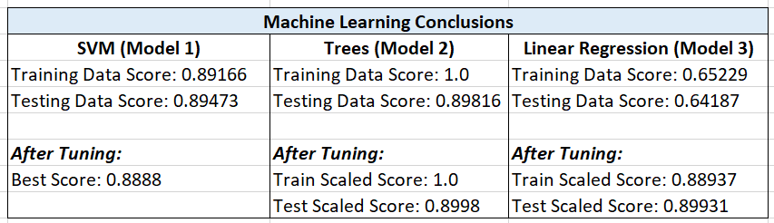

# Machine Learning Homework - Exoplanet Exploration

SVM (Model 1)
After using the StandardScaler to scale and normalize the data, the training and testing scores were around 0.89. After hyperparameter tuning the model's grid parameter to 'C': 10 and 'gamma': 0.0001 it didn't result in any score improvement.

Trees (Model 2)
When running the RandomForestClassifier to scale the data, the Training Data Score was 1.0 and the Testing Data Score was 0.89. After hyperparameter tuning the 'n_estimators' and 'max_features' the value stayed the same.

Linear Regression (Model 3)
When running the StandardScaler to scale the data, the Training Data Score was 0.65 and Testing Data Score was 0.64. After using GridSearchCV to tune the model's parameters and changing the 'penalty' and 'C' values it improved both the training and testing scaled scores to approximately 0.89.

Conclusion:
After running 3 tests on the models (SVM, Trees, and Linear Regression), the Trees test using a RandomForestClassifier performed the best with a 100% accuracy even before hyperparameter tuning.
